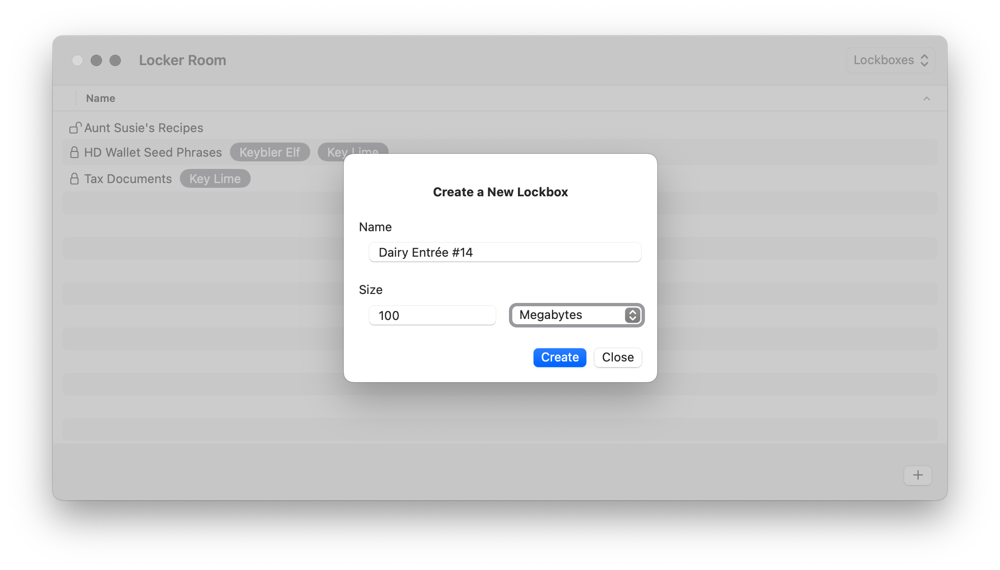
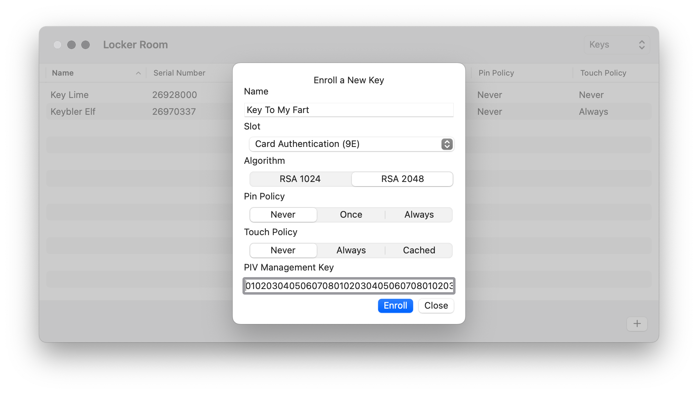

# Locker Room

### Abstract

Locker Room is a macOS application to create, encrypt and decrypt local disk images using a public-private key pair generated by an external hardware device. Locker Room is intended to secure digital assets with physical hardware. YubiKey is currently the only supported external hardware device.

### How-To

There are two top-level views in the application: **Lockboxes** and **Keys**. These views can be toggled between using the menu bar item located in the top-right corner of the application. The **Lockboxes** view shows a list of created lockboxes.

And the **Keys** view shows a list of enroll keys.

When the **Lockboxes** view is selected the plus button in the bottom-right corner will prompt the user to add a new lockbox.

And when on the **Keys** view is selected the plus button will prompt the user to enroll a new key using an external hardware device.

When a lockbox is created it starts off unencrypted and a user can add files to it. A lockbox cannot be encrypted until at least one key has been enrolled using an external hardware device. Once a key is enrolled the hardware device's corresponding public key is stored. The public key can later be used to encrypt lockboxes without the external hardware device present. Every enrolled key will be used when a lockbox is encrypted to support the use of multiple external hardware devices as backup for decryption. Keys enrolled after a lockbox has been encrypted will not be used to retroactively encrypt any previously encrypted lockboxes and therefore cannot be used to decrypt any previously encrypted lockboxes.

To enroll a key the user must switch to the **Keys** view and then click on the plus button. The user must specifiy a key name, PIV slot, algorithm, PIN policy, touch policy and the PIV management key to used when generating and storing the public-private key pair on the external hardware device. After the key details are configured, enrolling the key will wait for the external hardware device to become present. Once present the key enrollment process will complete.

A user can choose to encrypt a lockbox directly after it is created or they can choose to encrypt it later. Double-clicking on an unencrypted lockbox will prompt the user to encrypt it. And double-clicking on an encrypted lockbox will prompt the user to decrypt it. Encryption does not require an external hardware device to be present because only previously enrolled keys are used. Decryption does require an external hardware device to be present because the private key stored on the external hardware device is used for decryption. After the encrypted lockbox is selected ,decrypting the lockbox will wait for an external hardware device to become present. If the lockbox was encrypted using an enrolled key corresponding to the external hardware device then the decryption process will complete.

### Technical Details

### Known Issues

### Future Enhancements

### Contact

NSNolan - latesonarinn@gmail.com
