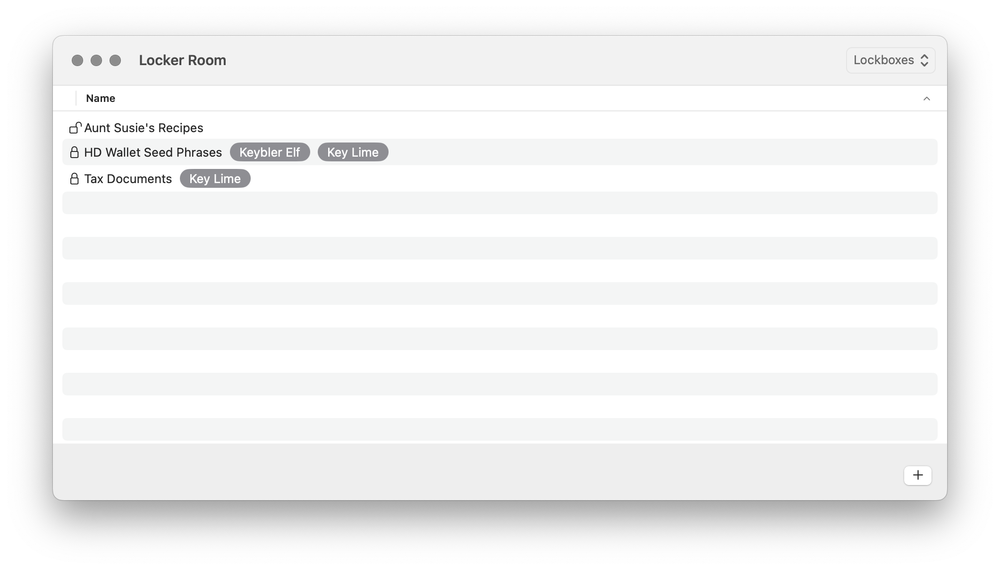
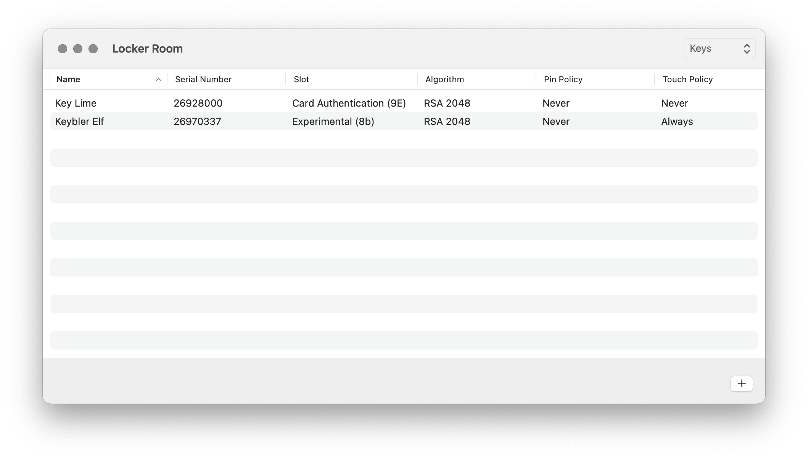

# Locker Room

### Abstract

Locker Room is a macOS application to create, encrypt and decrypt local disk images using a public-private key pair generated on an external hardware device. Locker Room is used to secure digital assets with physical hardware. YubiKey is currently the only supported external hardware device.

### How To Use

There are two top-level views in Locker Room: **Lockboxes** and **Keys**. These views can be toggled using the menu bar item in the top-right corner of the application. The **Lockboxes** view shows the list of created lockboxes:

And the **Keys** view shows the list of enrolled keys:

While the **Lockboxes** view is selected, the plus button in the bottom-right corner will prompt the user to create a new lockbox:

And while the **Keys** view is selected, the same plus button will instead prompt the user to enroll a new key using an external hardware device:

When a new lockbox is created it starts off unencrypted and a user can add files to it. The lock icon to the left of the lockbox name indicates whether or not it has been encrypted. A lockbox cannot be encrypted until at least one key has been enrolled using an external hardware device. Once a key is enrolled, the external hardware device's corresponding public key is stored on disk. The stored public key can then be used to encrypt lockboxes without the external hardware device present. By default, all enrolled key will be used when a lockbox is encrypted. Alternatively, a user can select specific enrolled keys to be used for encryption. Each encrypted lockbox in the **Lockboxes** view indicates which keys have been used for its encryption.

To enroll a key the user must first switch to the **Keys** view and then click the plus button. A key name and PIV slot must be provided when generating the public-private key pair on the external hardware device. Selecting "Show Advanced Options" will allow the user to specify the key algorithm, PIN policy, touch policy and PIV management key:

 After the key specifications are configured, Locker Room will wait for the external hardware device to become present. Once present the key enrollment process will complete. The resulting public key is stored on disk for future encryption and the private key always remains on the external hardware device for future decryption. Newly enrolled keys will not be used to retroactively encrypt previously encrypted lockboxes and therefore the corresponding external hardware device cannot be used to decrypt previously encrypted lockboxes.

A user can choose to encrypt a lockbox directly after it is created or they can choose to encrypt it later. Double-clicking an unencrypted lockbox from the list of lockboxes will prompt the user to encrypt it:

Selecting "Show Key Selection" will allow the user to specify which keys to use instead of using all enrolled keys for encryption:

And double-clicking an encrypted lockbox will prompt the user to decrypt it:
 

Encryption does not require an external hardware device to be present because only previously enrolled keys are used. Decryption does require an external hardware device to be present because the private key stored on the external hardware device is needed for decryption. After an encrypted lockbox is selected for decryption, Locker Room will wait for an external hardware device to become present. If the lockbox was encrypted using an enrolled key corresponding to the presented external hardware device then the decryption process will complete.

### Technical Details

A lockbox is logically a disk image. While a lockbox is unencrypted the disk image can be attached and a volume can be mounted as a filesystem. While a lockbox is encrypted, the disk image cannot be used.

An enrolled key is logically a public key and serial number that maps to an external hardware device containing the corresponding private key. The type of public-private key pair is determined by the configuration details used when the key is enrolled.

#### Encryption

When a lockbox is encrypted, a 256-bit symmetric cryptographic key is generated. This symmetric key is used to encrypt the lockbox with the AES GCM algorithm. The lockbox content is streamed into memory in 256KB chunks and each chunk is independently encrypted with a nonce and authentication tag. The subsequent cipher text, nonce, authentication tag and total length of the prior three components are encoded into the output stream of the encrypted lockbox. 

The symmetric cryptographic key used to encrypt the lockbox is also encrypted by all of the enrolled keys using the algorithm specified during key enrollment. These encrpyted symmetrics keys are stored on disk along side the encrypted lockbox. If multiple keys are enrolled then multiple copies of the symmetric key are encrypted and stored on disk. But there is only ever one copy of the encrypted lockbox.

#### Decryption

When a lockbox is decrypted, the serial number of the presented external hardware device is used to map back to the corresponding encrypted symmetric key stored on disk. The private key stored on the external hardware device is then used to decrypt the matching encrypted symmetric key using the algorithm specified during key enrollment.

The now decrypted symmetric key is used to decrypt the encrypted lockbox with the AES GCM algorithm. The encrypted lockbox content is streamed into memory in chuncks, where the chunck size is read directly from the input stream and each chunk is independently decrypted with a nonce and authentication tag. After decryption, all symmetric cryptographic keys are thrown away and never used for future encryption.

### Experimental Details

The YubiKey SDK allows for using the following PIV slots: PIV Authentication (9a), Digital Signature (9c), Key Management (9d), Card Authentication (9e) and Attestation (f9). These slots have canonical usages and do not typically store a raw RSA or ECC private key for encryption and decryption. Even though there is no direct support via the YubiKey SDK, there does exists 20 retired key management slots (82-95) capable of storing a raw private key. Locker Room allows a user to enroll a key using one of these unsupported PIV slots so the user does not have to reserve or misuse one of the supported slots for a Locker Room private key.

Enrolling a key with an unsupported PIV slot is achieved by sending [ADPU commands](https://docs.yubico.com/yesdk/users-manual/yubikey-reference/apdu.html) directly to the external hardware device. This bypasses the limitations of the YubiKey SDK and encodes the unsupported slot into the command's raw data.

### Known Issues

- Enrolling a key will overwrite an existing private key in the specified slot on the external hardware device.
- There is no way to enter a pin if the pin policy of the enrolled key is set to anything besides `Never`.
- Locker Room does not run in a sandbox because creating a disk image with `hdiutil` will fail.
- Encryption and decryption routines are not properly executed on a background thread.
- Decrypting lockbox view does not always appear after an external hardware device is detected.
- There is no version check of the YubiKey before the YubiKey SDK is used. This may lead to unsupported commands being sent to an incompatible external hardware device.
- Encrypted lockboxes cannot be deleted within Locker Room. But can be removed using the filesystem.
- Enrolled keys cannot be deleted within Locker Room. But can be removed using the filesystem.

### Future Enhancements

- 100% unit tests coverage.
- Allow enrolled key deletion within Locker Room but only after there are no more encrypted lockbox it can decrypt. Keys can be removed using the filesystem and there is currently no way to remove the corresponding private key on the external hardware device. Yubico [changelogs](https://github.com/Yubico/yubico-piv-tool/blob/master/debian/changelog) suggests that YubiKey firmware 5.7.0 will add support for deleting keys.
- Add localization strings for the UI.
- Write application log messages to the Unified Logging System.
- Encrypt and decrypt an external volume.
- Generate keys using elliptic curve cryptography. This is blocked by YubiKey's current support for RSA cipher text decryption only.

### Contact

NSNolan - latesonarinn@gmail.com
